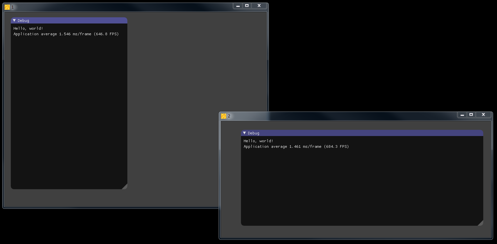

# SSB

DirectX10 multi window with IMGUI

## Getting Started

- Install visual studio 2017
- Download and install cmake from https://cmake.org/download/
- create build64 directory
- from a command line go in the build64 directory and run cmake
	$ cmake -G "Visual Studio 15 2017 Win64" ..
- open VS and load the created solution
- compile and run

## Screenshots

## License

This project is licensed under the MIT License - see the [LICENSE](LICENSE) file for details
